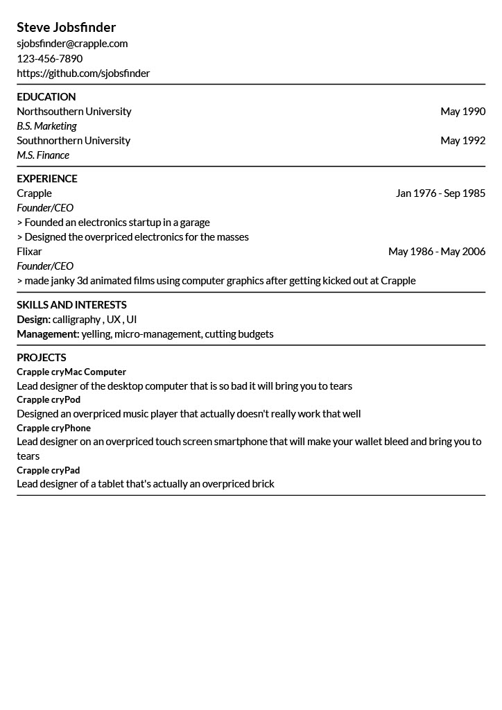

Repo for creating quick cleanly formatted resumes using a consistent template engine. 

This app is for anyone who wants to edit a simple text file to produce a cleanly formatted PDF, if using a word processor causes formatting issues.

Are you insane? Why use this when you can just use a word processor?

Probably, and you probably should, but all the word processors I've used caused formatting issues. This resume engine will produce a consistent document everytime.

Usage:

```ps
./quick-resume
```

Example:

Input: easily editable text file
``` toml
[Contact]
Name = "Steve Jobsfinder"
Email = "sjobsfinder@crapple.com"
Phone = "123-456-7890"
Links = { Linkedin = "https://linkedin.com/in/steve-jobsfinder", Github = "https://github.com/sjobsfinder" }

[Education]
Education = [
	{ Name = "Northsouthern University", Degree = "B.S. Marketing", GraduationDate = "May 1970" },
	{ Name = "Southnorthern University", Degree = "MBA", GraduationDate = "May 1972" },
]

[Experience]
[[Experience.Jobs]]
Company = "Crapple Inc"
Role = "Founder/CEO"
StartDate = "Jan 1976"
EndDate = "Sep 1985"
Tasks = [ "Founded an electronics startup in a garage ", "Designed the overpriced electronics for the masses", ]

[[Experience.Jobs]]
Company = "Flixar"
Role = "Owner"
StartDate = "May 1986"
EndDate = "May 2006"
Tasks = [ "made janky 3d animated films using computer graphics after getting kicked out at Crapple", ]


[Skills]
Skills = [
	{ SkillGroup = "Languages", SkillSub = "English, French" },
	{ SkillGroup = "Programming Languages", SkillSub = "C/C++, Python, C#, Java" },
]

[Projects]
[Projects.ProjectsDict]
"Crapple cryMac Computer" = "Lead designer of the desktop computer that is so bad it will bring you to tears"
"Crapple cryPod" = "Designed an overpriced music player that actually doesn't really work that well"
"Crapple cryPhone" = "Lead designer on an overpriced touch screen smartphone that will make your wallet bleed and bring you to tears"
"Crapple cryPad" = "Lead designer of a tablet that's actually an overpriced brick"
```

Output: Clean PDF Resume



[PDF](examples/resume.example1.pdf)

### For developers

If you want to use this simply download the release.

Create new visual studio console project 

Install QuestPDF from nuget

```cs

// Package Manager
Install-Package QuestPDF

// .NET CLI
dotnet add package QuestPDF

// Package reference in .csproj file
<PackageReference Include="QuestPDF" Version="2022.6.0" />
```

More details: https://www.questpdf.com/getting-started.html#what-to-expect

Before pushing to git repository, make sure you clean build artifacts:

At root directory:

`dotnet clean`


### TODO
- update UI